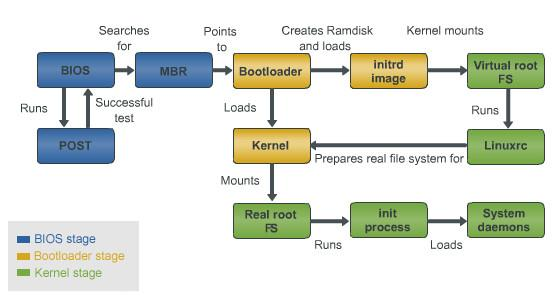
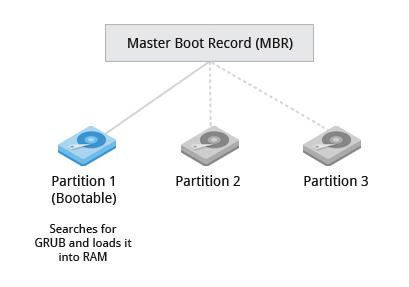
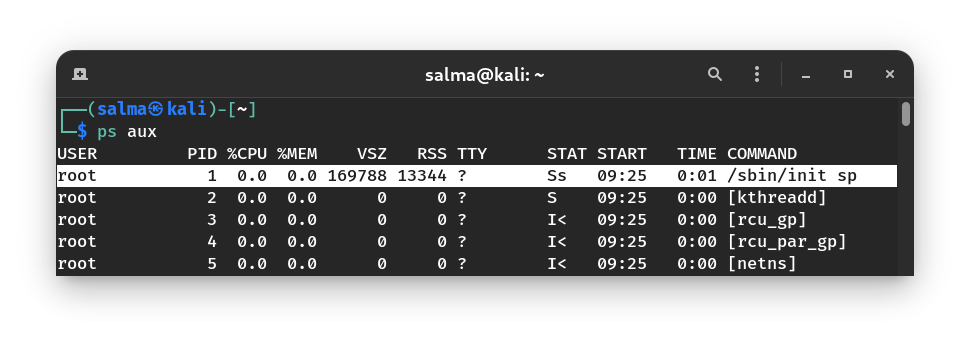
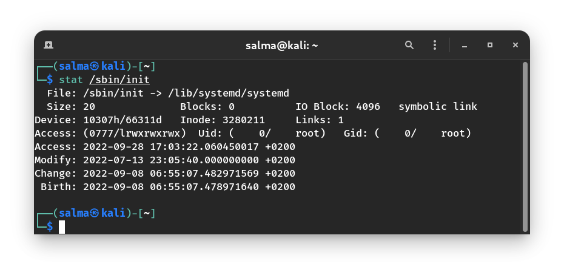

# Linux Boot & Startup Processes

Understanding the Linux **boot** and **startup** processes is important to being able to both configure Linux and to resolving startup issues.

There are two sequences of events that are required to boot a Linux computer and make it usable: **boot and startup**.

**The boot sequence** starts when the computer is **turned on**, and is completed when the kernel is initialized and **systemd** is launched. **The startup process** then takes over and finishes the task of getting the Linux computer into an operational state.

The Linux boot and startup process comprises the following steps :

  - 1. BIOS Stage
  - 2. Boot loader Stage
  - 3. Kernel Stage
  - 4. Start systemd, the parent of all processes.

----------------------------------------------------------

# The Boot Process

The boot process can be **initiated** in one of a couple ways :
    
   - If power is turned off, **turning on the power** will begin the boot process. 
    
   - If the computer is already running a local user, including root or an unprivileged user, the user can programmatically initiate the boot sequence by using the GUI or command line to initiate a **reboot**. A reboot will first do a shutdown and then restart the computer.

# 1. BIOS Stage

# BIOS POST (Power On Self Test)

**The first step** of the Linux boot process really has nothing whatever to do with Linux. This is the **hardware portion** of the boot process and is the same for any operating system. When power is first applied to the computer it runs the POST.

POST is the part of BIOS whose task is to ensure that the computer hardware functioned correctly (such as processors, memory, keyboard …etc.). 

If the BIOS finds any errors during the POST, it will notify you by a series of **beeps or a text message** displayed on the screen. An error at this point is almost always a **hardware problem**.

If POST fails, the computer may not be usable and so the boot process does not continue.

### MBR (Master Boot Record) and Boot Loader

Once the POST is completed, BIOS checks the MBR in any attached bootable devices to check if it refers to the location of the boot loader (You can press a key (typically `F12` or `F2`, but it depends on your system) during the BIOS startup to change the boot sequence.) and then the system control passes from the BIOS to the boot loader. 

The boot loader is usually stored on one of the hard disks in the system, either in the **boot sector** (for traditional BIOS/MBR systems) or the **EFI partition** (for more recent (Unified) Extensible Firmware Interface or EFI/UEFI systems).

### How to check UEFI or BIOS in Linux?

The easiest way to find out if you are running UEFI or BIOS is to look for a folder `/sys/firmware/efi`. The folder will be missing if your system is using BIOS.

------------------------------------------------

# 2. Boot loader Stage

A boot loader is loaded by **BIOS** or **UEFI** after a successful POST. 

On older computers with **BIOS**, a boot loader resides in the **MBR** (the first boot sector), but newer computers with **UEFI** store it in a special partition called **EFI System Partition**.

A bootloader is a program responsible for loading the **Linux kernel** and the **Linux initial RAM disk**, known as **initrd or initramfs**. 

**Linux kernel** is the **core** of the Linux operating system, and it starts the **init** (short for initialization) process, or an init replacement such as **systemd**, immediately after being loaded. 

### Initial RAM Disk

The **initrd** is used by the Linux kernel as a **temporary filesystem** for loading critical files into memory before the real root file system can be mounted.

The **initrd** contains programs and binary files that perform all actions needed to mount the proper root filesystem. After the root filesystem has been found, it is checked for errors and mounted.

The mount program instructs the operating system that a filesystem is ready for use, and associates it with a particular point in the overall hierarchy of the filesystem (the mount point). 

> Instead of using initrd, some Linux filesystem will also use **initramfs**. It serves the same purpose of initrd.

Most Linux boot loaders can present a user interface for choosing alternative options for booting Linux, and even other operating systems that might be installed (e.g, MS Windows). 

There are three bootloaders used by most Linux distributions, **GRUB**, **GRUB2**, and **LILO**. **GRUB2 is the newest** and is used much more frequently these days than the other older options.

> GRUB2 (GRand Unified Bootloader) can allow the user to choose to boot from among **several different kernels** for any given Linux distribution. This affords the ability to boot to a previous kernel version if an updated one fails somehow or is incompatible with an important piece of software. 

> The default directory for grub configuration files is: `/boot/grub`

# 3. Kernel Stage

# Kernel Initialization

All the kernels are in a **self-extracting, compressed format** to save space. The kernel and its associated files are located in the `/boot` directory, along with an **initial RAM disk image**.

The kernel files are identifiable as they are all named starting with **vmlinuz**. You can list the contents of the `/boot` directory to see the currently installed kernels on your system.

After the selected kernel is loaded into memory and begins executing, it must first extract itself from the compressed version of the file before it can perform any useful work. Once the kernel has extracted itself, it loads **systemd**.

**This is the end of the boot process.** At this point, the Linux kernel and systemd are running but unable to perform any productive tasks for the end user because nothing else is running.

# The Startup Process

The startup process follows the boot process and brings the Linux computer up to an **operational state** in which it is usable for productive work.

# systemd

systemd is **the mother of all processes**, and it is responsible for bringing the Linux host up to a state in which productive work can be done. 

The **PID** (Process ID) of systemd process is always **1**. This process persists till the computer halts.

On my system, `/sbin/init` is a symlink to `/lib/systemd/systemd`:

------------------------------------------------------------------------

# Resources

- https://opensource.com/article/17/2/linux-boot-and-startup
- https://course.adinusa.id/sections/preview/the-boot-process