## Environment
- The shell maintains a body of information during our shell session called the environment.

- Data stored in the environment is used by programs to determine facts about our configuration.

- While most programs use configuration files to store program settings, some programs will also look for values stored in the environment to adjust their behavior. Knowing this, we can use the environment to customize our shell experience.


## What Is Stored In The Environment?
1. Environment Variables. 

2. Shell Variables.

3. Aliases.

4. Functions.

---
## What is a variable?
- You can think of the variable as a location that hold some information needed by a program to adjust its behavior.


## A list of the commonly used variables in Linux
<table>
<tr>
<th>Variable</th>
<th>Meaning</th>
<th>To view variable value type</th>
</tr>
<tr>
<td><kbd><strong>BASH_VERSION</kbd></strong></td>
<td>Holds the version of this instance of bash.</td>
<td><kbd>echo $BASH_VERSION</kbd></td>
</tr>
<tr>
<td><kbd><strong>HOSTNAME</kbd></strong></td>
<td>The name of the your computer. </td>
<td><kbd>echo $HOSTNAME</kbd></td>
</tr>
<tr>
<td><kbd><strong>CDPATH</kbd></strong></td>
<td>The search path for the cd command. </td>
<td><kbd>echo $CDPATH</kbd></td>
</tr>
<tr>
<td><kbd><strong>HISTFILE</kbd></strong></td>
<td>The name of the file in which command history is saved. </td>
<td><kbd>echo $HISTFILE</kbd></td>
</tr>
<tr>
<td><kbd><strong>HISTFILESIZE</kbd></strong></td>
<td>The maximum number of lines contained in the history file. </td>
<td><kbd>echo $HISTFILESIZE</kbd></td>
</tr>
<tr>
<td><kbd><strong>HISTSIZE</kbd></strong></td>
<td>The number of commands to remember in the command history. The default value is 500. </td>
<td><kbd>echo $HISTSIZE</kbd></td>
</tr>
<tr>
<td><kbd><strong>HOME</kbd></strong></td>
<td>The home directory of the current user. </td>
<td><kbd>echo $HOME</kbd></td>
</tr>
<tr>
<td><kbd><strong>LANG</kbd></strong></td>
<td>Used to determine the locale category for any category not specifically selected with a variable starting with LC_. </td>
<td><kbd>echo $LANG</kbd></td>
</tr>
<tr>
<td><kbd><strong>PATH</kbd></strong></td>
<td>The search path for commands. It is a colon-separated list of directories in which the shell looks for commands. </td>
<td><kbd>echo $PATH</kbd></td>
</tr>
<tr>
<td><kbd><strong>PS1</kbd></strong></td>
<td>Your prompt settings. </td>
<td><kbd>echo $PS1</kbd></td>
</tr>
<tr>
<td><kbd><strong>TERM</kbd></strong></td>
<td>Your login terminal type.</td>
<td><kbd>echo $TERM<br />export TERM=vt100</kbd></td>
</tr>
<tr>
<td><kbd><strong>SHELL</kbd></strong></td>
<td>Set path to login shell.</td>
<td><kbd>echo $SHELL</kbd></td>
</tr>
<tr>
<td><kbd><strong>EDITOR</kbd></strong></td>
<td>Set name of default text editor.</td>
<td><kbd>export EDITOR=/usr/bin/vim</kbd></td>
</tr>
</table>


## What is Difference between Shell Variables and Environment Variables?
- __Environment variables__:

  + are system wide and are inherited by all system processes and shells. 
  
  + Long Term Usage.

- __Shell variables__:

  + only apply internally to the current shell instance.
  
  + Short Term Usage.


- Their difference is similar to the difference between private fields and protected fields in a Java class.

  + The private fields of a Java class is only accessible from that Java class. The protected fields of a Java class is accessible from both that Java class and its subclasses.
  
  + The shell variables of a shell is only accessible from that shell process. The environment variables exported from that shell is accessible from both that shell process and the sub-processes created from that shell.


## How to show environment variables only?
- To list all environment variables with their values write ```printenv``` without any arguments:   

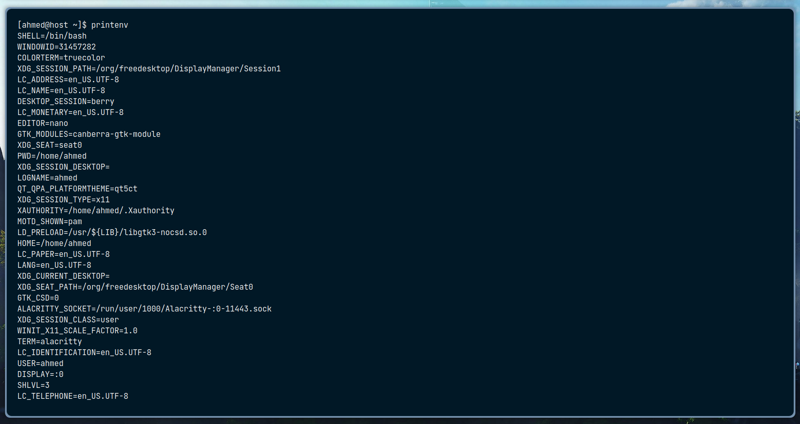


- To list the value of a specific environment variable write ```printenv``` followed by the variable name:     

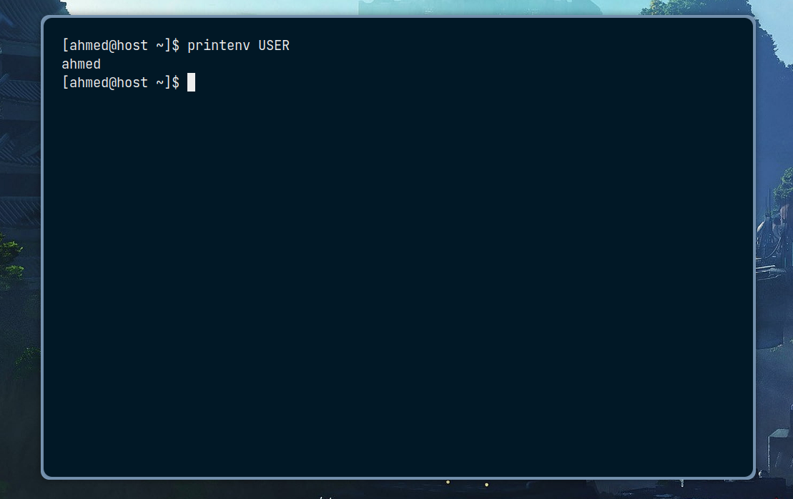

## How to show both environment variables and shell variables?
- To list all environment variables and all shell variables write ```set``` without any arguments:

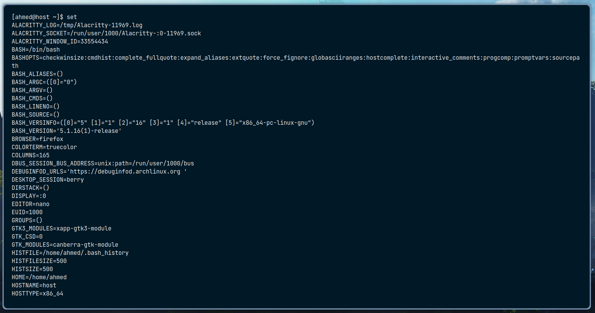

## How to convert Shell Variable to and Environment Variable?
- You need to ```export```,making it inheritable by child processes, this shell variable.

- Example:

  + the behavior of a shell variable before exporting it 
  
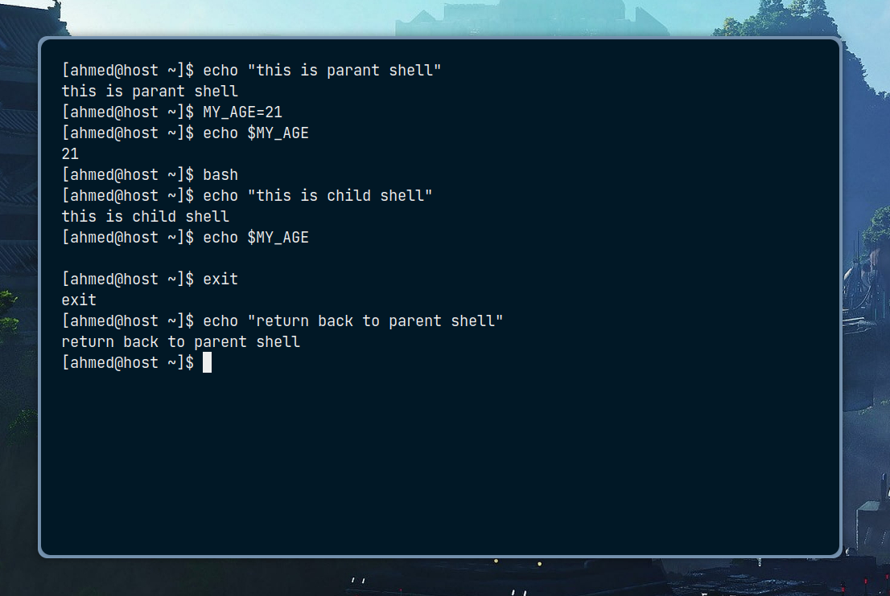


  + the behavior of a shell variable after exporting it
  
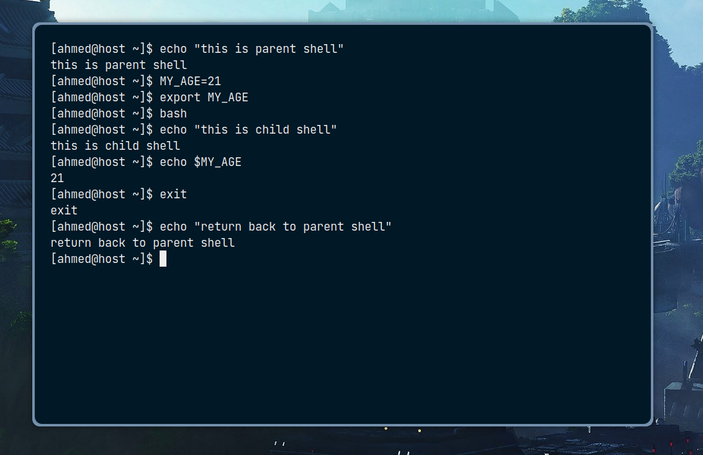
 
 
 
---

## What is Aliases?
- Alias is like a shortcut command which will have same functionality as if we are writing the whole command. 

## How to create aliases?
- write ```alias``` followed by ```new command``` followed by ```='original command'```

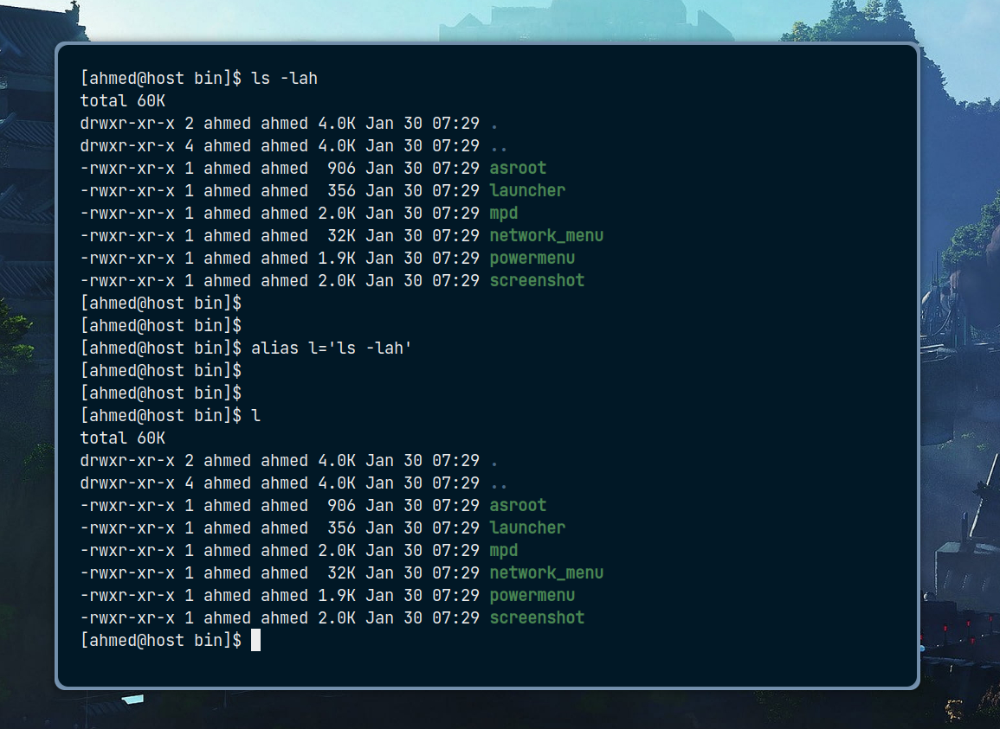

## How to list aliases?
- To list all aliases write ```alias``` without any arguments

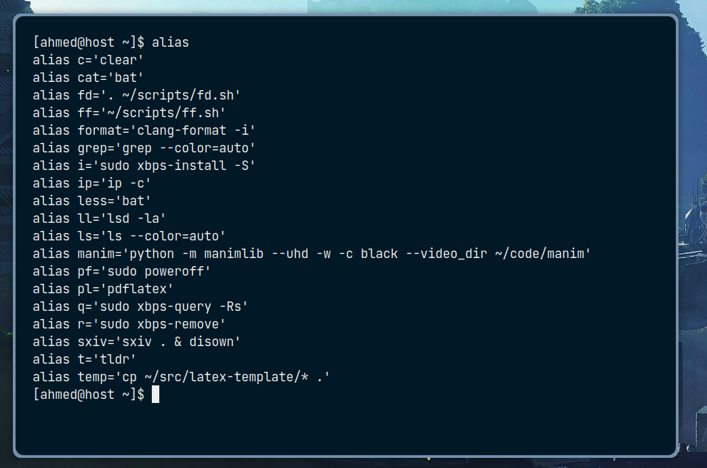


- To show to value of a specific alias write ```alias``` followed by ```alias name```


---
## What is a function?
- A function is simply a “chunk” of code that you can use over and over again, rather than writing it out multiple times.

- Functions enable programmers to break down or decompose a problem into smaller chunks, each of which performs a particular task. 

## How to create function in bash?
- You can create functions in different ways one of them is to write the keyword ```function``` followed by ```function-name()``` followed by ```{ your code ;}```

- In order for a function to perform the code inside it it needs to be called by just write __the name of the function__.

- Look at the following example:

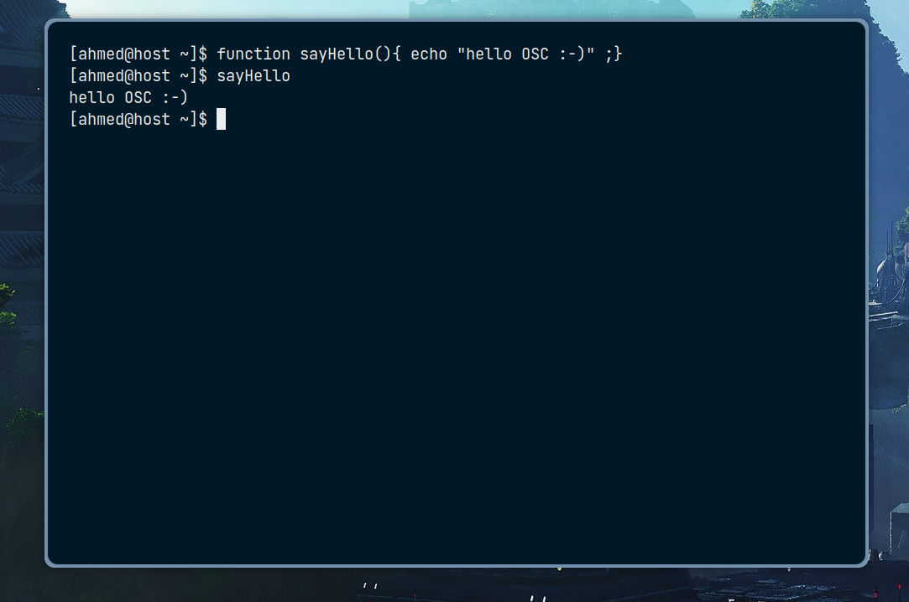

---

## How Is The Environment Established?
When we log on to the system, the bash program starts, reads and execute a series of configuration scripts called startup files, which define the default environment shared by all users.

This is followed by more startup files in our home directory that define our personal environment and the exact sequence depends on the type of shell session being started.

There are two kinds:

- Interactive Login Shell Session.

- Interactive Non-login Shell Session.

## What is difference between and Interactive Shell and Non-Interactive Shell?
```Interactive``` - Interactive means that the commands are run with user-interaction from keyboard. E.g. the shell can prompt the user to enter input.  

```Non-interactive``` - the shell is probably run from an automated process so it can't assume it can request input or that someone will see the output. E.g., maybe it is best to write output to a log file.

- An interactive shell can be either login or non-login shell.		

__So...__		

## What is difference between Interactive Login Shell and Interactive Non-Login Shell?
- An interactive login shell is invoked when a user login to the terminal either remotely via ssh or locally, or when Bash is launched with the --login option. 

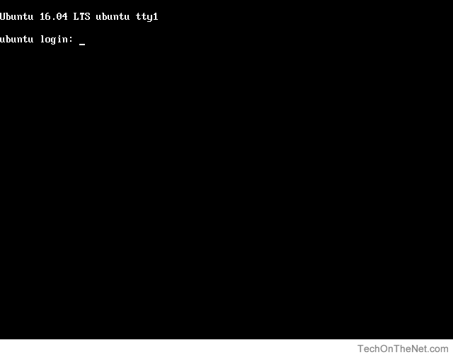

- An interactive non-login shell is invoked from the login shell, such as when typing bash in the shell prompt or when opening a new terminal tab.

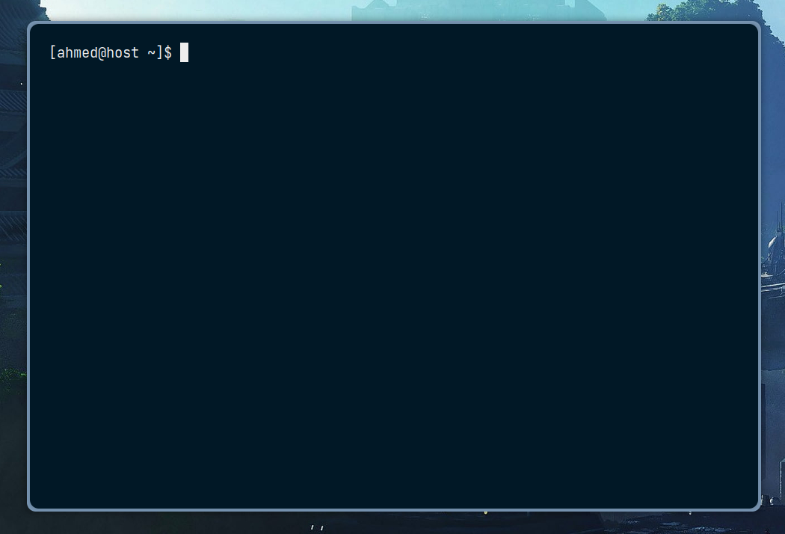

## Startup files for Login Shell Sessions
When bash is invoked as Interactive Login Shell, bash looks for the following files in order:

1. ```/etc/profile```- A global configuration script that applies to all users.

2. ```~/.bash_profile``` - A user's personal startup file. It can be used to extend of override settings in the global configuration script.

3. ```~/.bash_login``` - If ~/.bash_profile is not found, bash attempts to read this file.

4. ```~/.profile``` - If neither ~/.bash_profile nor ~/.bash_login is found, bash attempts to read this file. 
	  + This is the default file in Debian-based distributions, such as Ubuntu.


## Startup Files for Non_Login Shell Sessions
When bash is invoked as Interactive Non-Login Shell, bash looks for the following files in order:

1. ```/etc/bash.bashrc``` - A global configuration script that applies to all users.

2. ```~/.bashrc``` - A user's personal startup file. It can be used to extend or override settings in the global configuration script.

In addition to reading the startup files above, non-login shells also inherit the environment from their parent process, usually a login shell.

## How to check if the shell is login shell or non-login shell?
- if the output of the ```$0``` variable is    

   

     then this shell is a login shell.

- if the output of the ```$0``` variable is  


     then this shell is a non login shell.


## When should i use ```~/.bashrc``` file?
- Put the commands that should run every time you launch a new shell in the ```~/.bashrc``` file. This include your aliases, functions, and shell variables.

  + you can add  aliases to ```~/.bashrc``` as following:
  
  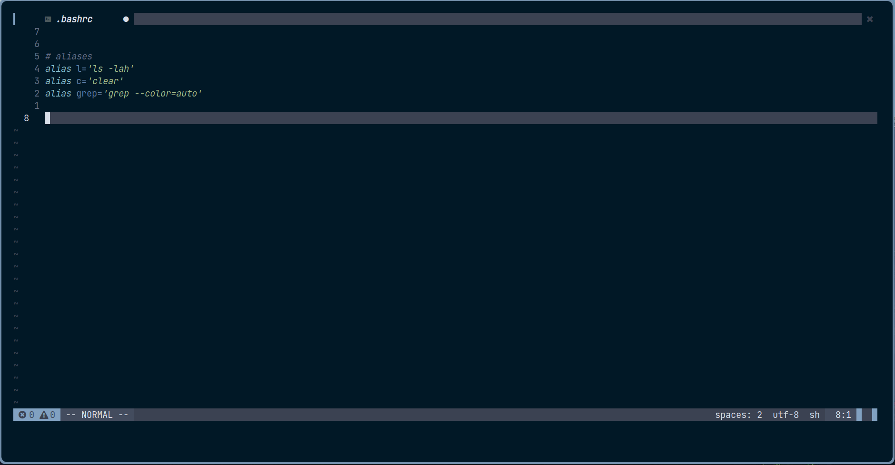

  + you can add functions to ```~/.bashrc``` as following: 
  
  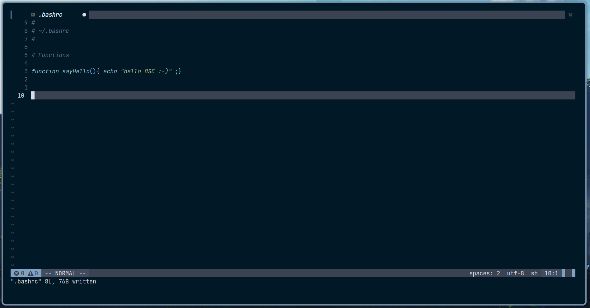

  + you can add shell variables to ```~/.bashrc``` as following: 
  
  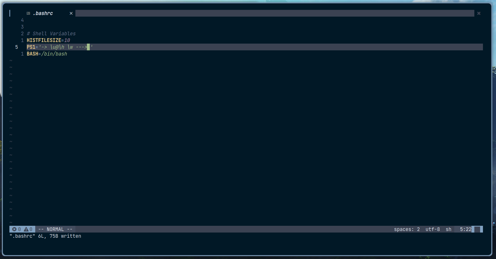


## When should is use ```~/.bash_profile``` file?

- Use .bash_profile to run commands that should run only once, such as environment variables.

  + you can add environment variables to ```~/.bash_profile``` as following: 
  
  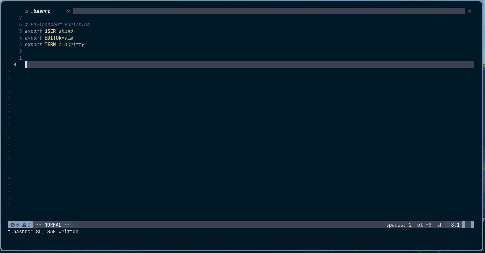
---

## How to include files in .bashrc file?
- You can just write ```source``` following by ```file path```

- We can use this to organize our .bashrc file by for example put our alias in different file and source(include) it in .bashrc

- You can put your aliases in different file and source it in .bashrc as folllowing:

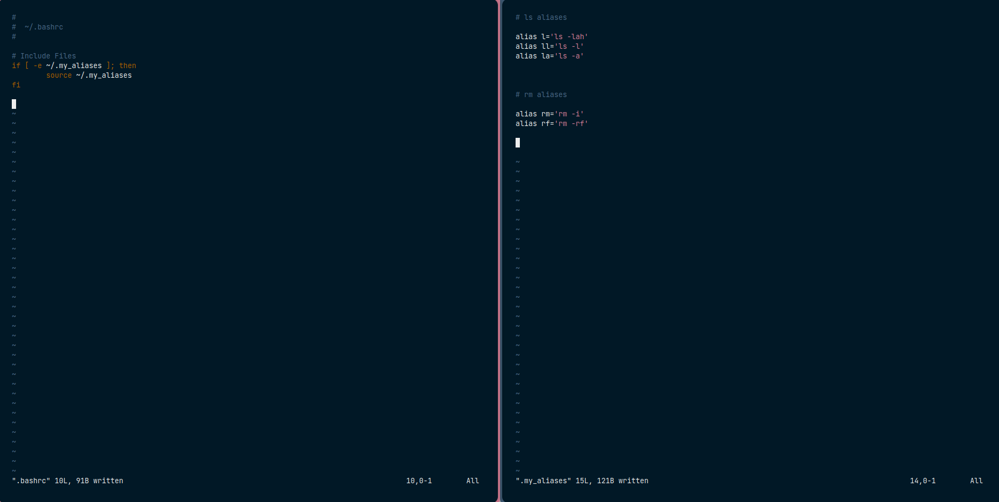

- You can put your functions in different file and source it in .bashrc as folllowing:  

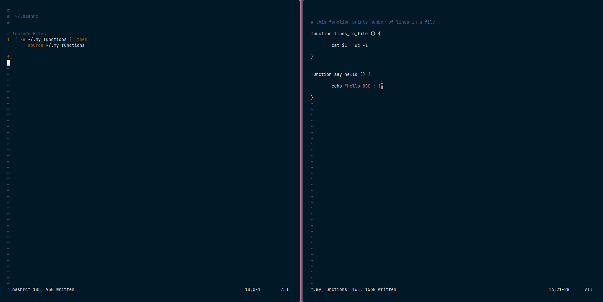

  NOTE: Functions in the previous figure are written in different valid syntax than the previous one we created before.
  
---
## For Your Knowledge
[What are the Different Types of Shells in Linux?](https://www.digitalocean.com/community/tutorials/different-types-of-shells-in-linux)

[How To Customize Bash Prompt.](https://www.baeldung.com/linux/customize-bash-prompt)

[EzPrompt Tool For Prompt Customization.](https://ezprompt.net/)  
