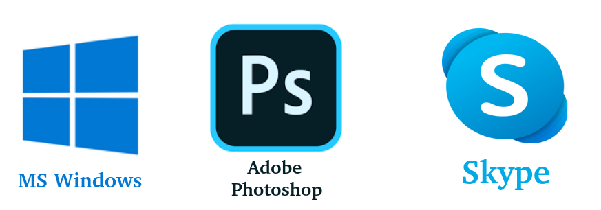
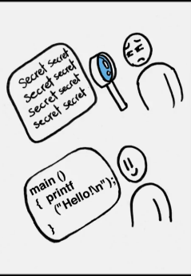
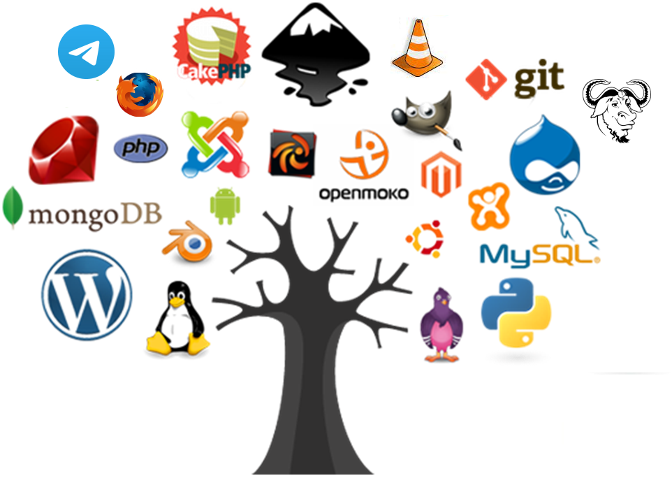

# Closed (proprietary) Source Software

Some software has source code that only the person, team, or organization that created it can see, or change, or distribute. This software is sometimes called "proprietary" or "closed source" software. Typically, the license only allows the end user to run the program, and provides no access, or tightly limited access, to the source.

### Paid Proprietary Software

- This is proprietary software that needs some sort of payment to be used.
- It isn’t available for unlimited use, most of the time.
- You can’t modify, redistribute, or study the software.
- You don't even have access to the source code.

### Freeware

- This is proprietary software that is free of charge.
- In some cases it is allowed to be shared, and also allowed to be used without restrictions.
- However, you can’t modify or study the software.
- You also don't have access to the source code.

### Source Available Software

- This is proprietary software that has its source-code available.
- It can be free of charge or paid.
- It is available for unlimited use, most of the time.
- You can study and modify, but you can’t redistribute the software.

----------------------------------------------------------------------------------

# Free and Open Source Software (FOSS) 

It is a software that is distributed with its source code, making it **available for use**, **modification**, and **distribution** with its original rights. 

## The FOSS Definition

Open source doesn't just mean access to the source code. 

Stallman specified four essential fundamental freedom for a software to be Free and Open Source Software.

- **Freedom to run** the program as you wish, for any purpose
- **Freedom to study** how the program works, and modify it to your computing needs. Access to the source code is a prerequisite for this.
- **Freedom to redistribute** copies, so you can help your neighbor.
- **Freedom to distribute** copies of your modified versions to others. This relies on the sentiment of community and paying the benefit forward. Access to the source code is a prerequisite for this.

**The ‘free’ in Free and Open Source Software doesn’t mean it is free of cost. It means freedom to run, modify and distribute the software.**

> Most Free and Open Source Software are available free of cost.

> Open source development today is overwhelmingly professional. Many developers are paid by their organizations to work with open source projects to construct and contribute the enhancements they and their customers need.

## FOSS vs Free Software 

It may be true that all free software is zero-cost, but not all zero-cost software is free as in “freedom” — that is, the freedom to share and modify for any purpose. Think freeware, for example, the only thing you could do was download an executable and run it. You couldn’t get the source code, and even if you could, you didn’t have the right to modify or redistribute it.

**All FOSS is free but not all free software is open source.**

# How do FOSS projects make money?

It is a myth that open source projects don’t make money. **Red Hat was the first open source company to reach the billion dollars mark.** IBM bought Red Hat for **$34 billion**. There are many such examples.

Many open source projects, specially the ones in the enterprise sectors, offer support and enterprise oriented features for a fee. This is main business model for Red Hat, SUSE Linux and more such projects.

Many open source projects, specially the desktop applications, rely on donations. VLC, GIMP, Inkscape and other such open source software fell in this category. There are ways to fund open-source programs but usually, you’ll find donation links on project websites.

Making money with open source software may be difficult, but it is not entirely impossible.

## Comparison

------------------------------------------------------------------

# Open Source History 

The idea of making source code freely available originated in 1983 from an ideological movement informally founded by **Richard Stallman**, a programmer at MIT.

Stallman believed that software should be accessible to programmers, so they could modify it as they wished, with the goal of understanding it, learning about it, and improving it.

So **Stallman** founded the **GNU project** and then **Linus Trovalds** joined the **GNU GPL**. 

This new approach and ideology surrounding software creation took hold and eventually led to the formation of the Open Source Initiative (OSI) in 1998.

[Richard Stallman Free software Song](https://www.youtube.com/watch?v=9sJUDx7iEJw)

# Open Source Initiative (OSI)

The Open Source Initiative (OSI) was created to promote and protect open source software and communities.

To be OSI certified, the software must be distributed under a license that guarantees the right to read, redistribute, modify, and use the software freely. 

## Types of open source licenses

There is more than one way to provide open source software. The terms of the software license control how the source can be combined with other code or reused, and hundreds of different open source licenses exist. 

There are two broad classes of open source license that are particularly important:

- **Copyleft licenses** that are designed to encourage keeping code open source.
- **Permissive licenses** that are designed to maximize code reusability.

### Copyleft Licenses

When a person gets **copyright** of the software, his main intention is to prevent other people from distributing the software. Copyleft is exactly the opposite of copyright. 

Copyleft, or "share-alike" licenses, require that anyone who distributes the source code, with or without changes, must also pass along the freedom for others to also copy, change, and distribute the code.

The basic advantage of these licenses is that they help to keep existing code, and improvements to that code, open and add to the amount of open source code available. 

Common copyleft licenses include the **GNU General Public License (GPL)** and the **Lesser GNU Public License (LGPL).**

### Permissive licenses

Permissive licenses are intended to maximize the reusability of source code. Users can use the source for any purpose as long as the **copyright and license** statements are preserved, including reusing that code under more restrictive or even **proprietary** licenses. This makes it very easy for this code to be reused, but at the risk of encouraging proprietary-only enhancements. 

In other words, when a user modifies a software, he or she is not obligated to make their altered software open-source, however, the user usually needs to give credit to the original project.  

Several commonly used permissive open source licenses include the **MIT/X11 license**, the **Simplified BSD license**, and the **Apache Software License 2.0**.

### Copyleft v. permissive

Both copyleft and permissive licenses allow users to copy, modify, and redistribute code freely. However, the main difference between the two lies in the degree of restrictiveness regarding their distribution. 

When one modifies a copyleft software, one is obligated to keep their new altered code under open source, so it can be publically available. Whereas, when one modifies a permissive software, there is no such restriction except to give credit to the original work.

> If you don’t apply an open source license, everybody who contributes to your project also becomes an exclusive copyright holder of their work. That means nobody can use, copy, distribute, or modify their contributions – and that “nobody” includes you.

----------------------------------------------------------------------------------

# Importance of Open Source 

### Learning 

Open source provides great learning opportunities for new programmers.

### Contribute & enhance your resume 

Any developer can contribute to open source projects.

### Don't reinvent the wheel 

Programmers can use pre-existing code to improve the software and even come up with their own innovations.

### Freedom 

Four freedoms: run, study, modify and share

### Confidentiality

The owner of the program most likely won't insert malicious code inside their programs if it's open source because many developers will review the code.

-------------------------------------------------------

# OSS Examples 

- GNU/Linux
- Blender
- VLC media player 
- GIMP
- Git
- Firefox
- Python
- Android
- …etc

------------------------------------------
-----------------------------------------