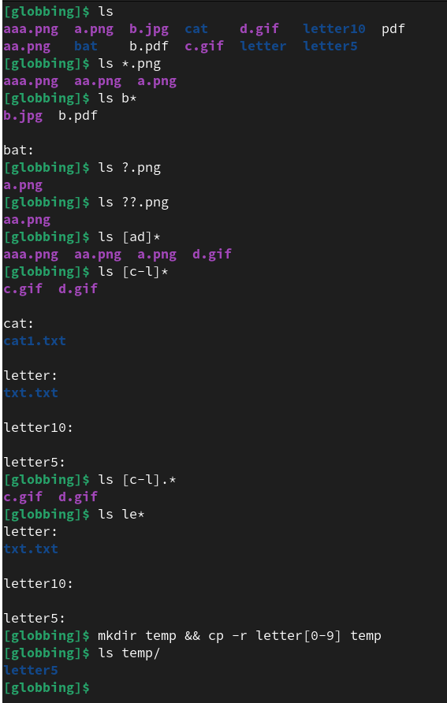
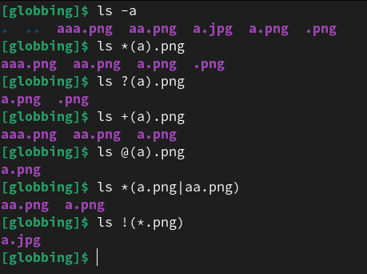
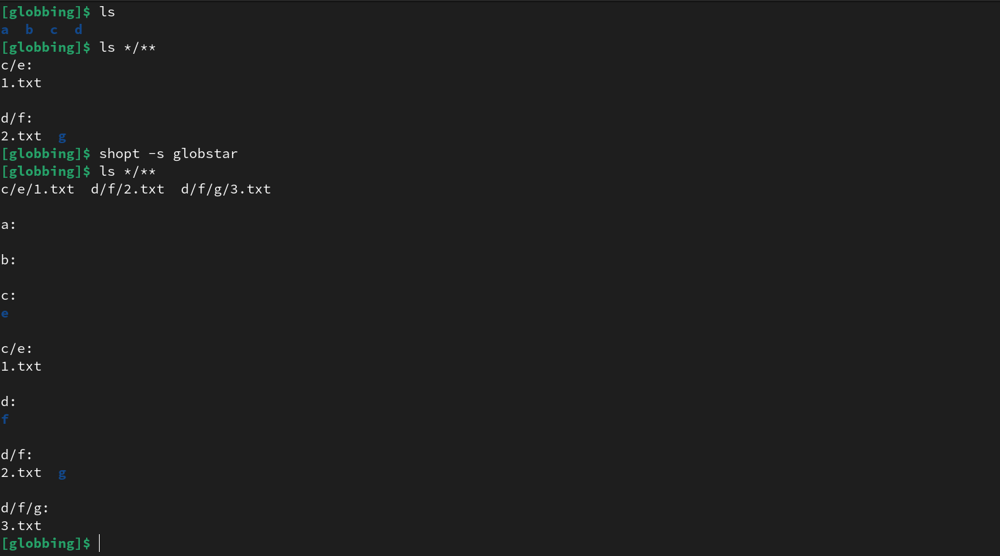

# File Globbing

# Glob Patterns

- Glob patterns specify sets of **filenames** with **wildcard characters**. For example, the Lnix Bash shell command `mv *.txt textfiles/` moves all files with names ending in `.txt` from the current directory to the directory `textfiles`. `*.txt` is a **glob pattern**.

- The glob short for global. The operation of matching of wildcard patterns (glob patterns) to multiple file or path names is referred to as **globbing**.

- The patterns rules are applied to segments of the filename **(stopping at the path separator, `/`)**. Paths in the pattern can be relative or absolute. Shell variable names and tilde (~) are not expanded.

- The Bash shell supports the following extensions:

    - **Basic Patterns**
    - **Extended Globbing (extglob)**
    - **Globstar**
    
    > It's better to make sure that the (extglob / globstar) is set by issuing the `shopt` command without any arguments.

## Basic Patterns

**Asterisk**

- `*` matches **zero or more characters** within a file or directory name. 

**Question Mark**

- `?` matches **one character** within a file or directory name. 

**Character Sets**

- `[]` matches **one character** from set or range of characters within a file or directory name. 

    - `[acs]` matches one character given in the bracket.
    - `[a-z]` matches one character from the range given in the bracket

**Leading !**

- Leading `!` changes the meaning of an include pattern to **exclude**.
    - `[!abc]` matches one character that is not given in the bracket.
    - `[!a-z]` matches one character that is not from the range given in the bracket.

> Note, multiple leading `!` flips the meaning.

**Braces Expansion**

- `{x,y,z}` Expand values between braces. 
    - `touch {1,2,3}.txt` creates the files `1.txt`, `2.txt`, `3.txt`.


### Examples




---------------------------------------------------------------

## Extended Globbing (extglob)

- In addition to the simple wildcard characters, bash also has extended globbing, which adds additional features.

|    Pattern    |                         Description                        |
|---------------|------------------------------------------------------------|
| `*(patterns)` | Match **zero** or **more** occurrences of the patterns.    |
| `?(patterns)` | Match **zero** or **one** occurrences of the patterns.     |
| `!(patterns)` | Match anything that **doesn't match** one of the patterns. |
| `+(patterns)` | Match **one** or **more** occurrences of the patterns.     |
| `@(patterns)` | Match **one** occurrence of the patterns.                  |




> Note, extended globs cannot span directory separators. For example, +(hello/world|other) is not valid

-----------------------------------------------------------

## Globstar

**Double-Asterisk**

- `**` : recursively match any number of layers of non-hidden directories. For example, /hello/**/* matches all descendants of /hello.



----------------------------------------------------------

## Escaping

Wrapping special characters in `[]` can be used to escape literal glob characters in a file name. For example the literal file name `hello[a-z]` can be escaped as `hello[[]a-z]`. You can also use a backslash `hello\[a-z\]`.

------------------------------------------------------------------

# Glob – Filename Pattern Matching vs. Regexp

- Regular expressions are used **for pattern matching in text**. File name globbing is used by shells for **matching file and directory names** using **wildcards**.

- Globs **are not** considered regular expressions. Globs attempt to match the entire string (for example, S*.DOC matches S.DOC and SA.DOC, but not POST.DOC or SURREY.DOCKS), whereas, depending on implementation details, regular expressions may match a substring.

- The wildcards may look similar to regular expressions, indeed `[...]` has the same meaning in globbing and regex. But `*` and `?` mean different things in globbing and regex.

|Common Wildcard| Equivalent Regex |
|---------------|------------------|
|       `?`     |	  `.`          |
|       `*`     |	  `.*`         |


|     Extglob     | Equivalent Regex |
|-----------------|------------------|
| ?(pattern-list) |   (...|...)?     |
| *(pattern-list) |   (...|...)*     |
| +(pattern-list) |   (...|...)+     |
| @(pattern-list) |   (...|...)    [@ not a RE syntax] |
| !(pattern-list) |   "!" used as for negative assertions in RE syntax |

----------------------------------------------------------
----------------------------------------------------------

# Exercises

### 1. Create the following files:

```
touch file1 file10 file11 file2 File2 File3
touch file33 fileAB filea fileA fileAAA
touch "file("
touch "file 2"
```

#### 1.1 List all files starting with file 

`ls file*`

#### 1.2 List all files starting with File

`ls File*`

#### 1.3 List all files starting with file and ending in a number.

`ls file*[0-9]`

#### 1.4 List all files starting with file and ending with a letter

`ls file*[a-z]`

#### 1.5 List all files starting with File and having a digit as fifth character.

`ls File[0-9]*`

#### 1.6 List all files starting with File and having a digit as fifth character and nothing else.

`ls File[0-9]`

#### 1.7 List all files starting with a letter and ending in a number.

`ls [a-z]*[0-9]`

#### 1.8 List all files that have exactly five characters.

`ls ?????`

#### 1.9 List all files that start with f or F and end with 3 or A.

`ls [fF]*[3A]`

#### 1.10 List all files that start with f have i or R as second character and end in a number.

`ls f[iR]*[0-9]`


#### 1.11 List all files that do not start with the letter F.

`ls [!F]*`


#### 1.12 List the files in the current directory with `echo`

`echo *`

### 2. List all the JPEG and GIF files that start with either "ab" or "def"

- With extended globbing : `ls +(ab|def)*+(.jpeg|.gif)` 

- Without extended globbing : `ls ab*.jpg ab*.gif def*.jpg def*.gif`

### 3. List all the files that aren't JPEG or GIF files and start with either "ab" or "def". 

- `ls !(+(ab|def)*+(.jpg|.gif))`

### 4. List all the files that match the regular expression "`ab(2|3)+.jpg`"

- `ls ab+(2|3).jpg`

### 5. List all the files that aren't JPEGs or GIFs

- `ls !(*.jpg|*.gif)`

>  `ls *!(.jpg|.gif)` -->  that doesn't work because the ".jpg" and the ".gif" of any file's name end up getting matched by the "*" and the null string at the end of the file name is the part that ends up not matching the "!(...)" pattern. 


--------------------------------------------

# Activities

**Let's play with some patterns.**

- [10 Practical Examples](https://www.tecmint.com/use-wildcards-to-match-filenames-in-linux/)


- A good directory to play with is `/etc` which is a directory containing config files for the system. Do a listing of that directory to see what's there. Then pick various subsets of files and see if you can create a pattern to select only those files. 

-------------------------------------------
-------------------------------------------

## Resources

- https://en.wikipedia.org/wiki/Glob_(programming)
- https://linux-training.be/funhtml/ch17.html#idp54066976
- https://www.linuxjournal.com/content/bash-extended-globbing
- https://github.com/doggy8088/vsts-docs/blob/master/docs/pipelines/tasks/file-matching-patterns.md#path-separators
