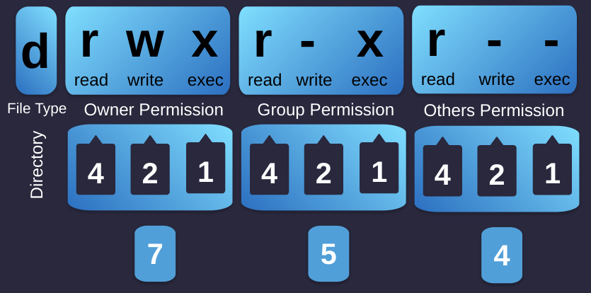
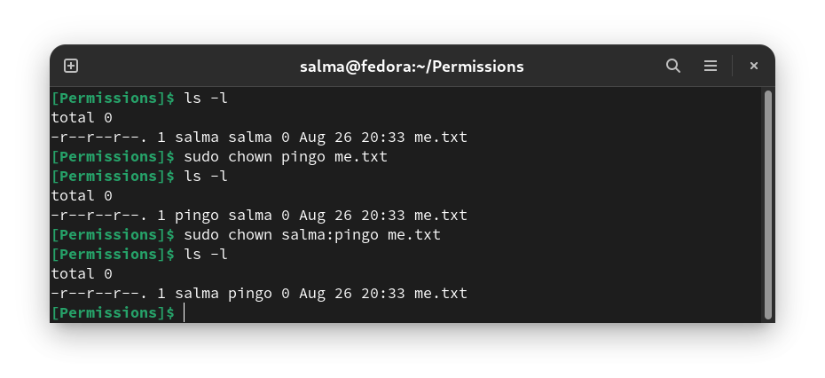
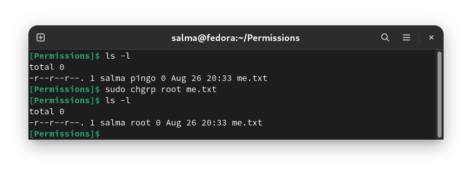

# Linux File Ownership

Every file and directory on your Unix/Linux system is assigned **3 types** of owner :

### User (Owner)

A user is the owner of the file. By default, the person who created a file becomes its owner.

### Group

A group can contain multiple users. All users belonging to a group will have the same Linux group permissions access to the file. 

### Other

Any other user who has access to a file. This person has neither created the file, nor he belongs to a group who could own the file. Practically, it means everybody else. Hence, when you set the permission for others, it is also referred as set permissions for the world.

--------------------------------------------------------------

# Linux File Permissions

Every file and directory in your UNIX/Linux system has following **3 permissions** defined for all the 3 owners discussed above.

### Read `r`

This permission give you the authority to open and read a file. 

Read permission on a directory gives you the ability to lists its content.

### Write `w`

The write permission gives you the authority to modify the contents of a file. 

The write permission on a directory gives you the authority to add, remove and rename files stored in the directory. 

Consider a scenario where you have to write permission on file but do not have write permission on the directory where the file is stored. You will be able to modify the file contents. But you will not be able to rename, move or remove the file from the directory.

### Execute `x`

In Windows, an executable program usually has an extension “**.exe**” and which you can easily run. In Unix/Linux, you cannot run a program unless the execute permission is set. If the execute permission is not set, you might still be able to see/modify the program code(provided read & write permissions are set), but not run it.

The write permission on a directory means that the contents of the directory can be accessed. (You can change into the
directory, read information about its files, and access its files if the files' permissions allow it.)

By default, any newly created files are not executable regardless of its file extension suffix.

### Note

Note that users normally have both read and execute permissions on read-only directories so that they can list the directory and have full read-only access to its contents. If a user only has read access on a directory, the names of the files in it can be listed, but no other information, including permissions or time stamps, are available, nor can they be accessed. 

If a user only has execute access on a directory, they cannot list the names of the files in the directory, but if they already know the name of a file that they have permission to read, then they can access the contents of that file by explicitly specifying the file name.

A file may be removed by anyone who has write permission to the directory in which the file resides, regardless of the ownership or permissions on the file itself. This can be overridden with a special permission, the **sticky bit**.

- `r` = read permission
- `w` = write permission
- `x` = execute permission
- `–` = no permission

> `ls -l` displays the size of space on the disk that is used to store the **meta information**. The file metadata details include information regarding its size, permissions, creation date, access date, inode number, UID/GID, file type etc. If it is i.e. 1024 this means that 1024 bytes on the disk are used for this purpose.

--------------------------------------------------------------

# Changing Permissions 

## `chmod` Command 

Chmod command stands for **change mode**. Using the command, we can set permissions (read, write, execute) on a file/directory for the owner, group and the world.

**Syntax:** `chmod permissions filename`

> The `chmod` command supports the `-R` option to recursively set permissions on the files in an entire directory tree.

- There are 2 ways to use the command :

    **1.** Absolute mode
    
    **2.** Symbolic mode

### Absolute(Numeric) Mode 

- In this mode, file permissions are not represented as characters but a three-digit octal number.

- The table below gives numbers for all for permissions types.

| Number | Permission Type       | Symbol |
|--------|-----------------------|--------|
|   0	 | No Permission         | `---`  |
|   1	 | Execute	             | `--x ` |
|   2	 | Write	             | `-w-`  |
|   3	 | Execute + Write       | `-wx`  |
|   4	 | Read	                 | `r--`  |
|   5	 | Read + Execute        | `r-x`  |
|   6	 | Read +Write	         | `rw-`  |
|   7	 | Read + Write +Execute | `rwx`  |

- Example : `chmod 764 sample`   
    - ‘764’ absolute code says the following:
        - Owner can read, write and execute
        - Usergroup can read and write
        - World can only read
    - This is shown as `-rwxrw-r--`

### Symbolic Mode 

In the Absolute mode, you change permissions for all 3 owners. In the symbolic mode, you can modify permissions of a **specific owner**. 

|Operator|Description|
|--------|-----------|
|   +    |Adds a permission to a file or directory. |
|   –    |Removes the permission. |
|   =    |Sets the permission and **overrides** the permissions set earlier. |

The various owners are represented as :

|User| Denotations |
|----|-------------|
| u  | user/owner  |
| g  | group       |
| o  | other       |
| a  | all         |

In this mode, file permissions are represented as `rwx`

----------------------------------------------------

# Changing Ownership and Group 

## `chown`

- For changing the ownership of a file/directory, you can use : `chown user filename`

- In case you want to change the user as well as group for a file or directory use the command : `chown user:group filename`

## `chgrp`

- In case you want to change group-owner only : `chgrp group_name filename` 

- ‘chgrp’ stands for **change group**.

----------------------------------------------------

## `groups` Command

You can use the command `groups` to find all the groups you are a member of.

---------------------------------------------------------------------
---------------------------------------------------------------------

## Resources

- https://www.guru99.com/file-permissions.html#:~:text=Linux%20divides%20the%20file%20permissions,ownership%20of%20a%20file%2Fdirectory.
- https://linuxize.com/post/etc-shadow-file/