# Shell, Bash, Shell Scripts & Bash Process Definitions

### Shell

It's a program that takes commands from the keyboard and gives them to the operating system to perform. (interprets and executes CL)

Different Types of Shells in Linux : sh, zsh, csh, ksh and bash
### Bash

It's a command language interpreter (particular shell). Also, it's the default command interpreter on most GNU/Linux systems.  

### Shell Scripts 

Shell scripts are plain text files that contains a series of commands that will be executed when the user runs the script. An important note is that anything you can run normally on the command line can be put into a script, and it will do exactly the same thing and vice versa.

It is convention to give a script the **.sh** extension. This is not a must since Linux is a **extensionless** system. You can give it whatever extension you want, and it will still work as a shell script.

### Bash Process

When we say we are running a program we are not really running the program but a copy of it which is called a **process**. What we do is copy those instructions and resources from the hard disk into working memory (or RAM). We also allocate a bit of space in RAM for the process to store variables (to hold temporary working data) and a few flags to allow the operating system to manage and track the process during its execution.

There could be several processes representing the same program running in memory at the same time. For example, you could have two terminals open and be running the command `cp` in both of them. In this case there would be two `cp` processes currently existing on the system. Once they are finished running the system then destroys them and there are no longer any processes representing the program `cp`.

When we are at the terminal we have a **Bash process** running in order to give us the Bash shell. If we start a script running **it doesn't actually run in that process but instead starts a new process to run inside**. 

> To execute the shell script in current shell, you can use : `source script.sh` or `. ./script.sh`

------------------------------------------------------------------------------

# Getting Started

As we say above anything you can run normally on the command line can be put into a script, and it will do exactly the same thing, so instead of using `echo` command in command line we will put it in a script and run it :

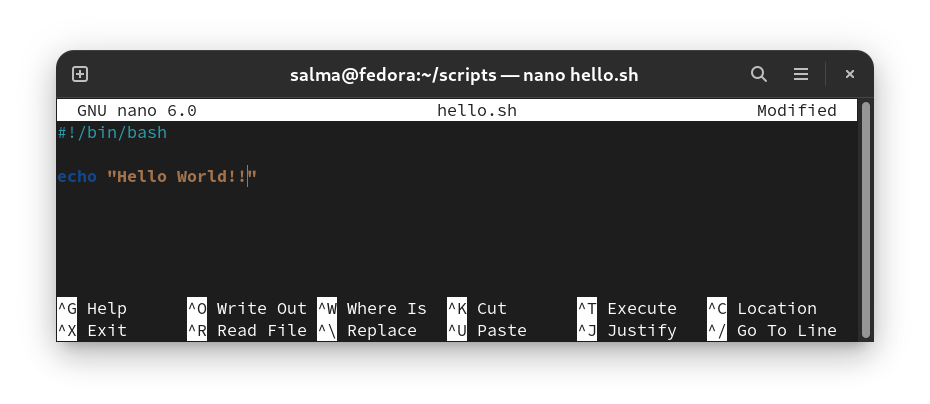

Let's break everything down :

# Shebang 

`#!/path/to/interpreter`

The hash exclamation mark (`#!`) is referred to as the **Shebang**. Following it is the path to the program that should be used to run the rest of the lines in the text file. For example, `#!/bin/bash` ensures that Bash will be used to interpret the script, even if it is executed under another shell.

You can check the path to Bash by viewing the content of `/etc/shells` on your machine.

### Ignoring Shebang

If you do not specify an interpreter line, the default is usually the `/bin/sh`. But, it is recommended that you set `#!/bin/bash` line for your bash scripts.

# Script Execution

- To run a script in :

    - **Same directory :** 
        - `./script.sh`
            -  will read the `#!` line to determine the program to run **script.sh**.

        - `bash script.sh`
            - will ignore the `#!` line, because bash is specified as the program to run **script.sh**.

    - **Another directory :**
        - `pathToTheFile/script.sh`
        - `bash pathToTheFile/script.sh`

    **Before we can execute a script using `./script.sh` it must have the execute permission set : `chmod +x script.sh`**

## `./`

- When you just type a name on the command line (e.g,`ls`) Bash tries to find it in a series of directories stored in a variable called **$PATH**. So because the current directory isn't in your **$PATH**, you need the `./` bit to tell the shell where the executable is.  `.` denotes the current directory. 

## $PATH

- To see what's in your $PATH : `echo $PATH`

- If you want to execute a script by just typing in its name no matter what directory you're in, simply add `/path/to/the/file` to the `$PATH` variable with the following command : `export PATH=$PATH:/place/with/the/file` but if you restart your computer or create a new terminal instance, your addition to the path **will be gone!** The variable $PATH is set by your shell every time it launches. To set your $PATH permanently, add the line from above, `export PATH=$PATH:/place/with/the/file`, to the appropriate file that will be read when your shell launches. 

- There are a few different places where you could conceivably set the variable name: potentially in a file called `~/.bash_profile`, `~/.bashrc`, or `~/.profile` if you're using Bash. For other shells, you'll want to find the appropriate place to set a configuration at start time; ksh uses `~/.kshrc`, zsh uses `~/.zshrc`. Check your shell's documentation to find what file it uses.

-----------------------------------------------

# Bash Parameters

- In a bash context a parameter is an entity that stores values. 

- There are three types of parameters:

   - **Variable** is a parameter denoted by a name.  
        - E.g, `varname=value`

   - **Positional Parameter** is assigned by one or more arguments **supplied** to a script **upon the script execution**. 
        - E.g, `$1`, `$2`.

   - **Special Parameter** are denoted by a one or more special characters: `*`, `@`, `#`, `?`, `-`, `$`, `!`
        - E.g, `echo $*`

----------------------------------------------------

# Variables

- Variables names are **case-sensitive** and **can't start** with a number, but can **start** with an underscore.

- To assign a value to a variable:
    - `varname="text with spaces"`
    - `varname='text with spaces without any processing'`
    - `varname=textwithoutspaces`
    - `varname=20`

- The shell does not care about types of variables; they may store strings, integers, real numbers - anything you like. So there is no syntactic difference between:

    - `varname="Hello World"`
    - `varname=hi`
    - `varname=1`
    - `varname=3.142`
    - `varname="3.142"`
    - `varname=123abc`

- When reading a variable, we place `$` before its name to tell Bash that **this word is a variable**. Bash replaces every variable prepended by `$` with its actual value :

    - `varname` ⇾ refers to the variable.
    - `$varname` ⇾ refers to the value of the variable.

## Variable Rules

- The name of a variable can contain only **letters**, **numbers** or the underscore character **_**.
    > The reason you cannot use other characters such as `!`, `*`, or `-` is that these characters have a special meaning for the shell.

- There must be **no spaces** around the **"="** sign: 
    - `var=value`   ⇾ **works**
    - `var = value` ⇾ **doesn't work**.

    In the first case, the shell sees the "=" symbol and treats the command as a variable assignment. In the second case, the shell assumes that var must be the name of a command and **tries to execute it**.

- A **string** with spaces must be **quoted** :
    - `var="Hello World"`  ⇾ **right** 
    - `var=Hello World`    ⇾ **wrong**

    In the first case, the string "Hello World" is assigned to var. In the second case, the shell will try to execute the command `World` after assigning `var=Hello`.

- **Or** you can also use `\` as an escape character to prevent certain characters from being processed by the shell such as the space character:
    - `varname=text\ with\ spaces` ⇾ the same as `varname="text with spaces"`

- **Never name** your private variables using **UPPERCASE** characters. This is because uppercase variable names are **reserved** for **internal shell variables**, and you run a risk of overwriting them. This may lead to the dysfunctional or misbehaving script execution.

## Scope of Variables

- Variables in the Bourne shell do not have to be declared, as they do in languages like **C**. But if you try to read an undeclared variable, the result is the **empty string**. **You get no warnings or errors**. 

- This can cause some subtle bugs :

    - If you assign : `var=Hello` and then `echo $vat` then you will get nothing as the second `vat` is misspelled.

## Parameter Expansion

- Anytime you use a `$` followed by a **variable name** you're doing what bash calls Parameter expansion, e.g. `echo $a` or `a=$b`.

- Parameter expansion comes in many forms in bash:
    - The variable name can optionally be surrounded by braces, e.g. `${a}`. If the variable name is immediately followed by characters that could be part of a variable name then the braces are needed to delimit the variable name, for example if you remove the braces from `echo ${a}bc` bash will try to expand the variable "`abc`" rather than "`a`".

## Examples

#### Variables on CLI

Assigning variables and using them on command line :

####  Variables on Script

Creating a script that does the same thing :

--------------------------------------------------

# The Difference between `' '` and `" "`

- `" "` ⇾ Interprets what's inside it, including any expressions, variables, etc.
- `' '` ⇾ Interprets what's inside it literally, without calculating or expanding expressions.

- Example: **x=2**

    - `echo "$x"` outputs ⇾ 2
    - `echo '$x'` outputs ⇾ $x
    - `echo $x`   outputs ⇾ 2
    - `echo x`    outputs ⇾ x
    - `echo 'x'`  outputs ⇾ x

--------------------------------------------------

# Positional Parameters

- Positional parameters are the arguments given to your scripts when it is invoked. It could be from `$1` to `$N`. 

- When **N** consists of more than a single digit, it must be enclosed in braces like `${N}`, e.g, `${11}`.

- The variable `$0` is the **name of the script itself**.

### Example

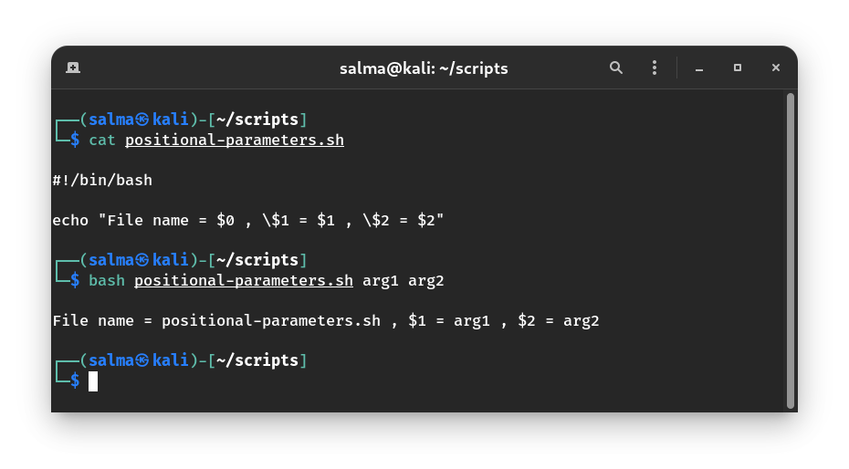

---------------------------------------------

# Special Parameters

The shell treats several parameters specially. These parameters may only be referenced; **assignment to them is not allowed**.

### `$0`

It's used to reference the **name of the shell** or **shell script** as we saw in positional parameters example.

### `$?`

Every Linux or Unix command executed by the shell script or user has an **exit status**. It's an integer number :

  - `0` exit status means the command was **successful** without any errors.
  - `A non-zero` (`1-255` values) exit status means command was a **failure**.

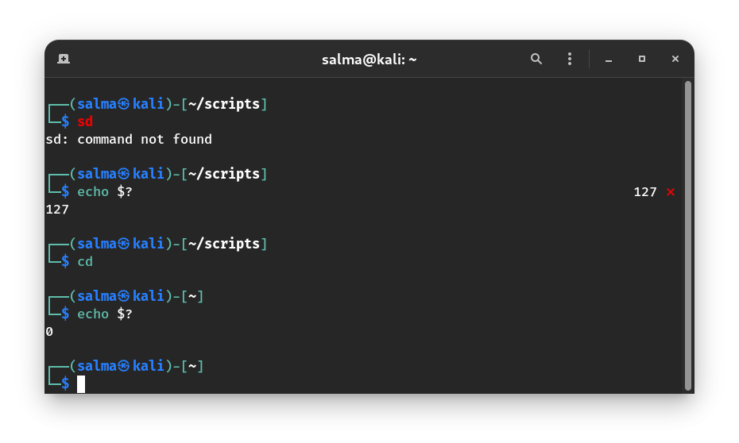

By using this you can check whether your bash script is completed successfully or not.

### `$_` 

Print the **last argument** of the previous command executed. At the **shell startup** (before writing any other command in your script), it gives the **absolute filename** of the **shell or bash script** which is being executed.
 

### `$#`

Expands to the **number of positional parameters**, **excluding $0** that was sent to a script.

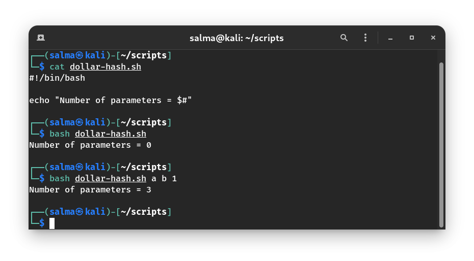

### `$$`

It's used to reference the **process ID of the current shell**. For shell scripts, this is the process ID under which they are executing.

### `$*` and `$@`

Both the parameters specify all the command-line arguments at once If a script receives two arguments, they are equivalent to `$1` `$2`. However, When expansion occurs inside **double-quotes** :

  - `"$@"` : When expansion occurs inside **double-quotes**, it takes the entire list and separates it into **separate arguments**.
  - `"$*"` : When expansion occurs inside **double-quotes**, it takes the entire list **as one argument** with spaces between.

## Summary

| Special bash parameter |	Meaning  |
|------------------------|-----------|
| `$0` |It's used to reference the **name of the shell** or **shell script**.|
| `$?` |It's used to get the **exit status** of the previous executed command in the **foreground**. |
| `$_` |It's used to print the **last argument** of the previous command executed. At the **shell startup**, it's used to reference the **absolute file name** of the **shell or bash script** which is being executed. This bash parameter is also used to hold the name of mail file while checking emails.|
| `$#` |It expands to a number of positional parameters that was sent to a script.|
| `$$` |The **process ID of the current shell**. For shell scripts, this is the process ID under which they are executing.|
| `$@` |It's used to expand into positional parameters starting from one. When expansion occurs inside **double-quotes**, it takes the entire list and separates it into **separate arguments**.|
| `$*` |It's used to expand into positional parameters starting from one. When expansion occurs inside **double-quotes**, it takes the entire list **as one argument** with spaces between.|

--------------------------------------------------------------

# Arithmetic Expansion

You can do 6 basic arithmetic operators in Bash:
 - `a + b` addition (a plus b)
 - `a - b` subtracting (a minus b)
 - `a * b` multiplication (a times b)
 - `a / b` integer division (a divided by b)
 - `a % b` modulo (the integer remainder of a divided by b)
 - `a ** b` exponentiation (a to the power of b)

We can do Arithmetic Expansion by just enclose any mathematical expression inside double parentheses `$((  ))`. For example: `a=$((5 - 3 + $b))` Which means: variable `a` is equal to the value of the expression `5 - 3 + $b`

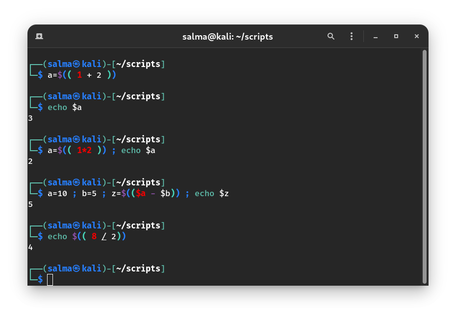

### `expr` Command

Evaluates a given expression and displays its corresponding output. It treats numbers containing a decimal point as strings.

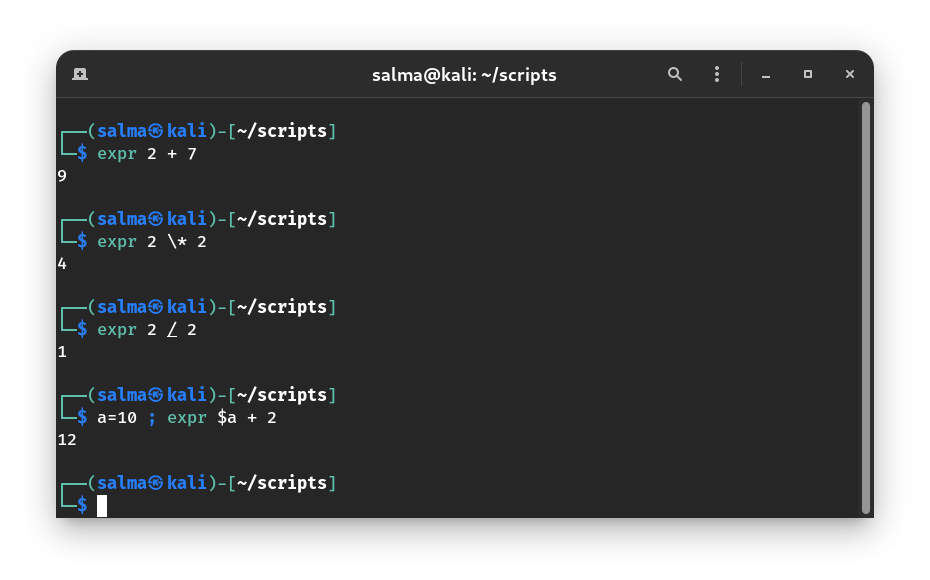

### `let` Command

Evaluates arithmetic expressions.

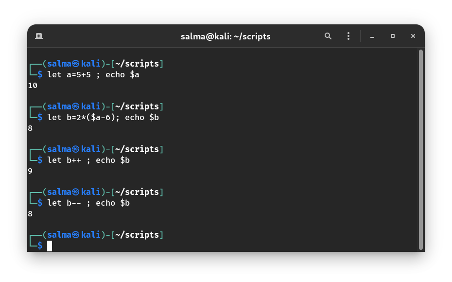

> `expr` and `let` commands work perfectly with integer numbers. `bc` command with a proper syntax allows for more than simple integer calculations.

--------------------------------------------------

# Taking Input from Terminal

### 1. Command Line Arguments (`$n`)

We discussed it above.

### 2. `read` Command

We can interactively set variable names using the `read` command. Read command automatically places **quotes** around its input, so that spaces are treated correctly

> You can use `read` with the `-p` flag to prompt the user with a question and take input at the same time. For example, ` read -p "Enter your name" name`

-------------------------------------------------------------

# Shell Variable Types

When a shell is running, three main types of variables are present :

### Local Variables 
 
A local variable is a variable that is present within **the current instance of the shell**. It is not available to child programs. 

### Global or Environment Variables 

An environment variable is a globally available, in **a program and its child programs**. 
    > The `env` command can be used to display environment variables.

#### `export` Command

It is used to define the environment variables. 

### Local vs Global Variables

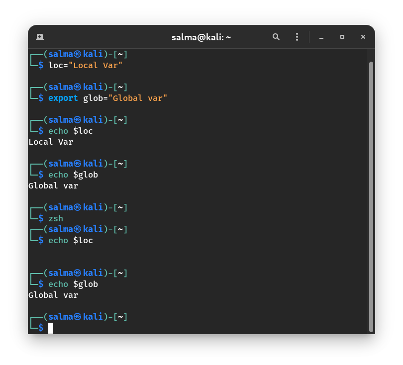

### Shell Variables 

A shell variable is a special variable that is set by the shell and is required by the shell in order to function correctly.

| Variable       | Description |
|----------------|--------------------------------------------------------------|
| `BASH_VERSION` | Bash version                                                 |
| `HOST_NAME`    | Host name                                                    |
| `HOME `        | Home directory                                               |
| `PATH `        | Executable locations                                         |
| `TERM `        | Default terminal                                             |
| `SHELL`        | Default shell                                                |
| `EDITOR`       | Default text editor                                          |
| `$USER`	     | The username of the user running the script                  |
| `$HOSTNAME`    | The hostname of the machine the script is running on         |
| `$SECONDS`     | The number of seconds since the script was started           |
| `$RANDOM`      | Returns a different random number each time is it referred to|
| `$LINENO`      | Returns the current line number in the Bash script           |

-----------------------------------------------------------------

# Comments `#`

- `#`: This marks the line as a comment, and it is ignored completely by the shell.

- The only exception is when the very first line of the file starts with `#!`. 

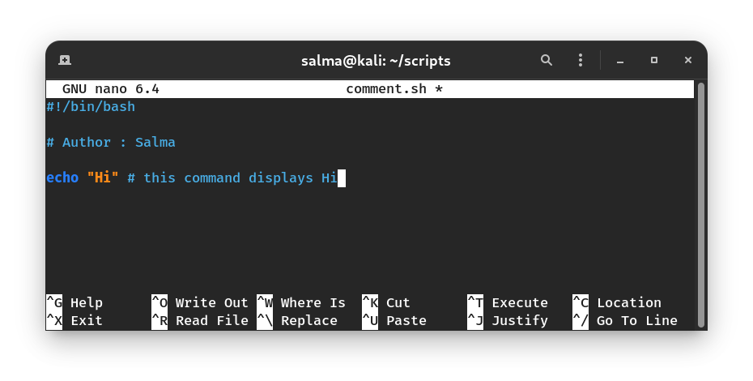

----------------------------------------------------------------

# Command Substitution

**Syntax :** `` `command` `` or `$(command)`

> Note that we use the back quote, not the single quote character.

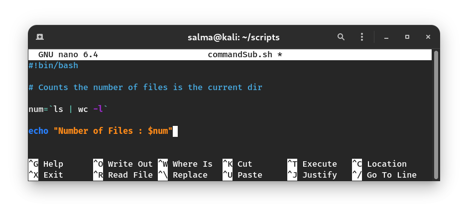

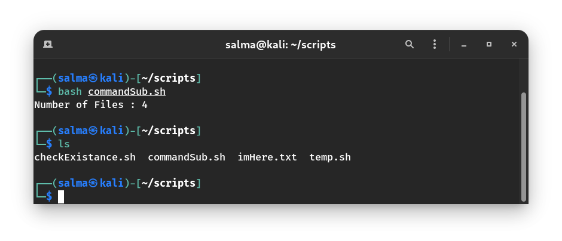

---------------------------------------------